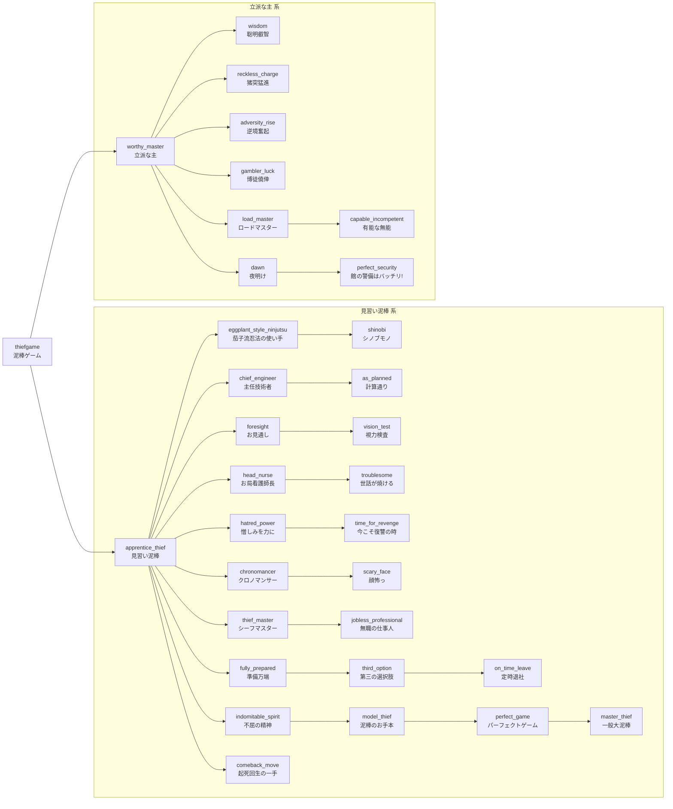

# 実装している進捗
アイコン専用画像はすべて粘土玉(clay_ball)のカスタムモデルデータを使っている。

## 進捗一覧
### コピペ:|  |  |  |  |  |  |  |
| id | 親id | タイトル | 説明 | 隠し | 難易度 | 実装方法 | アイコン画像 |
| --- | --- | --- | --- | --- | --- | --- | --- |
| thiefgame | - | 泥棒ゲーム | 泥棒ゲームにようこそ! | false | task | ✅毎tick達成 | clay_ball(CMD1) |
| apprentice_thief | thiefgame | 見習い泥棒 | 館から脱出する。 | false | task | ✅脱出時に達成 | iron_ingot(CMD3) |
| eggplant_style_ninjutsu | apprentice_thief | 茄子流忍法の使い手 | 忍者で脱出する。 | false | task | ✅脱出時に忍者が達成 | red_dye(CMD1) |
| shinobi | eggplant_style_ninjutsu | シノブモノ | 透明化中に館の主に接近する。 | false | goal | ✅巻物所持者が近くに居たら達成 | snowball(CMD1) |
| chief_engineer | apprentice_thief | 主任技術者 | 技術者で脱出する。 | false | task | ✅脱出時に技術者が達成 | carrot_on_a_stick(CMD1) |
| as_planned | chief_engineer | 計算通り | 50ブロック以上離れた館の主が地雷を踏む。 | false | goal | ✅地雷発同時に技術者が50ブロック以上離れていたら達成 | carrot_on_a_stick(CMD2) |
| foresight | apprentice_thief | お見通し | 超能力者で脱出する。 | false | task | ✅脱出時に超能力者が達成 | carrot_on_a_stick(CMD3) |
| vision_test | foresight | 視力検査 | 超能力者の目を最長距離で当てる。 | false | goal | ✅最後の防具立ての近くに館の主がいたら達成 | carrot_on_a_stick(CMD4) |
| head_nurse | apprentice_thief | お局看護師長 | 看護師で脱出する。 | false | task | ✅脱出時に看護師が達成 | carrot_on_a_stick(CMD5) |
| troublesome | head_nurse | 世話が焼ける | 一度のゲームで味方を10回以上蘇生する。 | false | goal | ✅蘇生時に看護師がスコアを獲得 | carrot_on_a_stick(CMD6) |
| hatred_power | apprentice_thief | 憎しみを力に | 復讐者で脱出する。 | false | task | ✅脱出時に復讐者が達成 | carrot_on_a_stick(CMD7) |
| time_for_revenge | hatred_power | 今こそ復讐の時 | 復讐心が20になる。 | false | goal | ✅復讐心が20になったら達成 | carrot_on_a_stick(CMD8) |
| chronomancer | apprentice_thief | クロノマンサー | 時間魔術師で脱出する。 | false | task | ✅脱出時に時間魔術師が達成 | carrot_on_a_stick(CMD9) |
| scary_face | chronomancer | 顔怖っ | 時間停止中に館の主に接近する。 | false | goal | ✅時間停止中に館の主の近くに時間魔術師がいたら達成 | red_dye(CMD2) |
| thief_master | apprentice_thief | シーフマスター | 全ての職業で脱出する。 | false | challenge | ✅全ての職業脱出進捗を達成している人が脱出したら達成 | iron_ingot(CMD1) |
| jobless_professional | thief_master | 無職の仕事人 | 職業を選択せずに脱出する。 | false | goal | ✅脱出時に職業タグがついていない人が達成 | air |
| fully_prepared | apprentice_thief | 準備万端 | 脱出可能時間までに全ての色の鍵を手に入れる。 | false | task | ✅全ての鍵入手進捗を用意、脱出可能時間ではなかったら達成 | clay_ball(CMD2) |
| third_option | fully_prepared | 第三の選択肢 | 緊急脱出装置で脱出する。 | false | task | ✅脱出者のy座標が60..70だったら達成 | redstone_block |
| on_time_leave | third_option | 定時退社 | 脱出可能になってから40秒以内に脱出する。 | false | challenge | ✅脱出可能になったら40秒カウントを開始、それまでに脱出したら達成 | clock |
| indomitable_spirit | apprentice_thief | 不屈の精神 | 一度も死なずに脱出する。 | false | task | ✅死亡時にタグを付与、脱出時にタグがついていないと達成 | clay_ball(CMD3) |
| model_thief | indomitable_spirit | 泥棒のお手本 | 一度もダウンせずに脱出する。 | false | goal | ✅ダウン時にタグを付与、脱出時にタグがついていないと達成 | clay_ball(CMD4) |
| perfect_game | model_thief | パーフェクトゲーム | 一度もダメージを受けずに脱出する。 | false | challenge | ✅システム進捗でダメージを受けたらタグを付与、脱出時にタグがついていないと達成 | clay_ball(CMD5) |
| master_thief | perfect_game | 一般大泥棒 | 無職で一度もダメージを受けずに脱出する。 | true | challenge | ✅システム進捗でダメージを受けたらタグを付与、脱出時にタグがついていないかつ、職業タグがついていないと達成 | clay_ball(CMD6) |
| comeback_move | apprentice_thief | 起死回生の一手 | 怪しい薬で自己蘇生する。 | true | challenge | ✅自己蘇生時の処理で達成 | potion(CMD1) |
| worthy_master | thiefgame | 立派な主 | 館の主で勝利する。 | false | task | ✅館の主勝利時に達成 | clay_ball(CMD7) |
| wisdom | worthy_master | 聡明叡智 | 聡明で勝利する。 | false | task | ✅館の主勝利時に聡明が達成 | clay_ball(CMD8) |
| reckless_charge | worthy_master | 猪突猛進 | 猛進で勝利する。 | false | task | ✅館の主勝利時に猛進が達成 | clay_ball(CMD9) |
| adversity_rise | worthy_master | 逆境奮起 | 逆境で勝利する。 | false | task | ✅館の主勝利時に逆境が達成 | clay_ball(CMD10) |
| gambler_luck | worthy_master | 博徒僥倖 | 博徒で勝利する。 | false | task | ✅館の主勝利時に博徒が達成 | clay_ball(CMD11) |
| lord_master | worthy_master | ロードマスター | 全ての能力で勝利する。 | false | challenge | ✅全ての能力勝利進捗を達成している人が勝利したら達成 | clay_ball(CMD12) |
| capable_incompetent | lord_master | 有能な無能 | 能力を選択せずに勝利する。 | false | goal | ✅勝利時に能力タグがついていない人が達成 | air |
| dawn | worthy_master | 夜明け | 一人も脱出させずに制限時間を迎える。 | false | task | ✅制限時間で終了したら達成 | bell |
| perfect_security | dawn | 館の警備はバッチリ! | 2階解放前に勝利する。 | true | challenge | ✅勝利時にarea2タグがついていないと達成 | shield |

## 進捗ツリー

